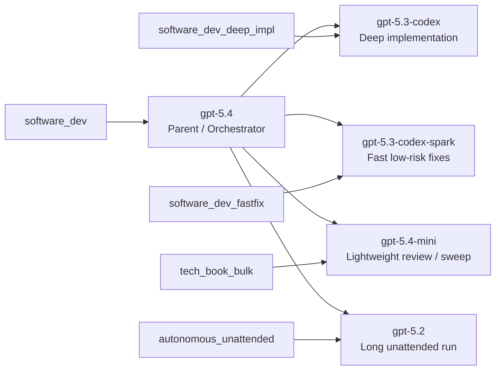
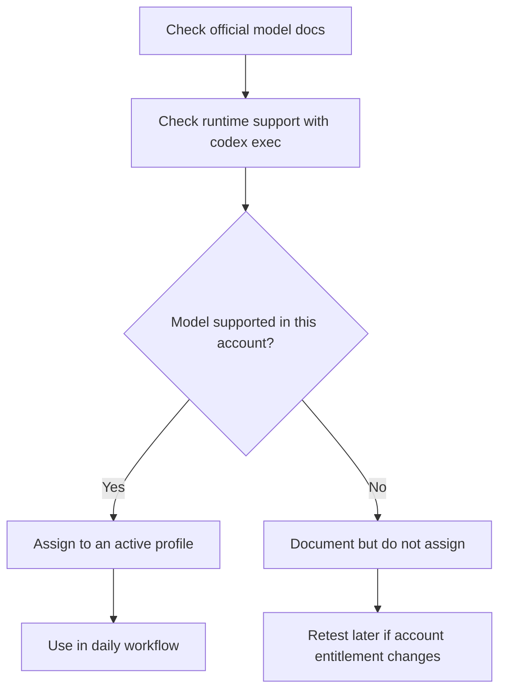

# Codex CLI Model Playbook

[](./LICENSE)
[](https://github.com/itdojp/codex-cli-model-playbook)
[](./examples/model-support.20260418.example.json)


A reusable playbook for designing Codex CLI model roles, profile mappings, and account-level compatibility checks.

Repository URL: https://github.com/itdojp/codex-cli-model-playbook

日本語要約:
- Codex CLI のモデル選定を「親エージェント」「実装エージェント」「高速修正」「長時間無人実行」「技術書執筆」に分けて設計するための公開用資料です。
- OpenAI 公式 docs のモデル特性と、実際の `codex exec` によるアカウント別の実行可否を切り分けて扱います。
- GitHub 公開用のドキュメント、サンプル設定、日本語記事草案、モデル互換性チェック用スクリプトを含みます。

## Why this repository exists

Codex CLI users often face two problems:

1. The model picker shows multiple candidate models, but their practical roles are unclear.
2. A model that appears in the picker is not always executable for the current account.

This repository addresses both issues by separating:

- **official model characteristics** from OpenAI docs
- **runtime compatibility** verified with `codex exec`
- **operational profile design** for real workflows

## Architecture at a glance



## Adoption flow



## Contents

- `docs/model-matrix.md`
  - Characteristics of each Codex CLI model and recommended usage.
- `docs/profile-design.md`
  - Recommended profile architecture for software engineering and technical book authoring.
- `docs/profile-catalog.md`
  - Purpose-specific profile catalog such as software development, fast-fix, and technical review.
- `docs/model-usage-status.md`
  - Which models are visible, which are actually used, and why.
- `docs/account-compatibility.md`
  - How to test what the current account can actually execute.
- `docs/quick-commands.md`
  - Startup commands for development, authoring, review, and compatibility checks.
- `docs/publishing-plan.md`
  - How to publish this as a GitHub repository and derive an external Japanese article from it.
- `docs/repository-metadata.md`
  - Suggested repository name, description, and topic tags.
- `examples/config.sample.toml`
  - Sample Codex configuration based on the documented design.
- `examples/agents/`
  - Sample subagent definitions.
- `examples/instructions/`
  - Reusable instruction files for software development and technical writing workflows.
- `scripts/check_codex_model_support.py`
  - Runtime support checker for the current Codex account.
- `LICENSE`
  - Public-content license aligned with other itdojp public repositories.
- `articles/ja/codex-cli-model-redesign-ja.md`
  - Draft Japanese article derived from the repository content.

## Better public release strategy

Use a two-layer publication model:

1. **GitHub repository** for durable reusable assets
   - sample config
   - agent definitions
   - checker scripts
   - versioned docs
2. **Japanese article** for narrative explanation and discovery
   - motivation
   - design rationale
   - lessons learned
   - link back to the repository

This is more reusable than publishing only an article.

## Recommended operating model

### Software development
- Parent/orchestrator: `gpt-5.4`
- Deep implementation: `gpt-5.3-codex`
- Fast small fixes: `gpt-5.3-codex-spark`
- Long unattended execution: `gpt-5.2`

### Technical book authoring
- Main authoring: `gpt-5.4`
- Bulk consistency/editorial sweep: `gpt-5.4-mini`
- Code sample verification: `gpt-5.3-codex`

## Quick commands

### Software development
```bash
codex -p software_dev
codex -p software_dev_deep_impl
codex -p software_dev_fastfix
codex exec -p autonomous_unattended "<task>"
```

### Technical writing
```bash
codex -p tech_book
codex -p tech_book_bulk
codex -p tech_book_review
```

See also: `docs/quick-commands.md`

## Important principle

Do not rely only on what the picker shows.
Always verify the target model with a real command such as:

```bash
codex exec -m gpt-5.4 --skip-git-repo-check "Reply with OK only."
```

## Quick start

### 1. Check runtime support in your account

```bash
python3 scripts/check_codex_model_support.py \
  --models gpt-5.4 gpt-5.4-mini gpt-5.3-codex gpt-5.3-codex-spark gpt-5.2 \
  --summary-only --output notes/model-support.json
```

### 2. Start from the sample config

```bash
cp examples/config.sample.toml ~/.codex/config.toml
```

Then customize paths, approval policy, and project trust settings.

### 3. Read the design docs

Start with:
- `docs/model-matrix.md`
- `docs/profile-design.md`
- `docs/profile-catalog.md`
- `docs/model-usage-status.md`
- `docs/quick-commands.md`

## Basis

This repository assumes:
- Codex CLI 0.121.0 or later
- OpenAI model documentation checked on 2026-04-18 JST
- The actual executable model set can differ by account entitlement

See the source links in each document.

## License

This repository follows the public-content license policy used by itdojp public content repositories.
See `LICENSE`.
